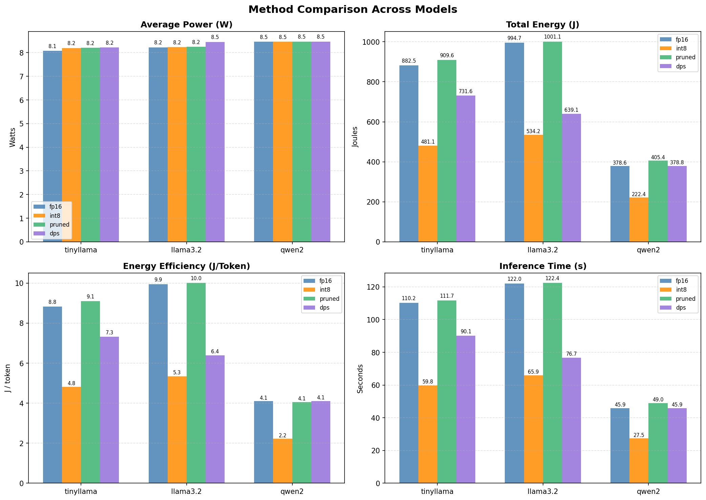

# Energy-Efficient LLM Inference on Low-Power Embedded Systems

Experimental software for the undergraduate dissertation **"Research and Development of Energy-Efficient Inference Methods for Generative AI (LLMs) on Low-Power Embedded Systems"** (Department of Informatics, Democritus University of Thrace, Kavala, 2026).

The framework benchmarks four inference strategies for small Large Language Models on a **Raspberry Pi 400**, measuring real, hardware-level power consumption with an external **Atorch UD18** USB power meter over Bluetooth, together with CPU/RAM utilisation, latency and energy per generated token.

| Method | Description |
|---|---|
| `fp16` | Full 16-bit floating point baseline, no optimisation |
| `int8` | Post-training `Q8_0` quantization (llama.cpp INT8 format) |
| `pruned` | 30% unstructured L1 magnitude pruning of all Linear layers, no retraining |
| `dps` | **Dynamic Precision Scaling**: run-level switching between fp16 and Q8_0 driven by measured seconds per token, with hysteresis |

Models evaluated: **TinyLlama 1.1B Chat**, **Llama 3.2 1B** and **Qwen2 0.5B**.

---

## Table of Contents

1. [Key Findings](#key-findings)
2. [System Architecture](#system-architecture)
3. [Repository Structure](#repository-structure)
4. [Module Description](#module-description)
5. [Dynamic Precision Scaling](#dynamic-precision-scaling)
6. [Energy Measurement Pipeline](#energy-measurement-pipeline)
7. [Hardware Requirements](#hardware-requirements)
8. [Installation](#installation)
9. [Obtaining the Models](#obtaining-the-models)
10. [Connecting the UD18 Power Meter](#connecting-the-ud18-power-meter)
11. [Running the Experiment](#running-the-experiment)
12. [Output Files](#output-files)
13. [Reference Results](#reference-results)
14. [Limitations](#limitations)
15. [Citation](#citation)
16. [License](#license)

---

## Key Findings

Mean of 5 runs per model/method combination, up to 100 generated tokens per run (60 runs in total).

| Model | Method | Time (s) | Power (W) | Energy (J) | J/token | RAM % |
|---|---|---:|---:|---:|---:|---:|
| TinyLlama | fp16 | 110.2 | 8.082 | 882.5 | 8.825 | 69.2 |
| TinyLlama | **int8** | **59.8** | 8.199 | **481.1** | **4.811** | **43.2** |
| TinyLlama | pruned | 111.7 | 8.207 | 909.6 | 9.096 | 69.8 |
| TinyLlama | dps | 90.1 | 8.217 | 731.6 | 7.316 | 92.2 |
| Llama3.2 | fp16 | 122.0 | 8.228 | 994.7 | 9.947 | 77.2 |
| Llama3.2 | **int8** | **65.9** | 8.236 | **534.2** | **5.342** | **48.0** |
| Llama3.2 | pruned | 122.4 | 8.246 | 1001.1 | 10.011 | 77.2 |
| Llama3.2 | dps | 76.7 | 8.452 | 639.1 | 6.391 | 94.7 |
| Qwen2 | fp16 | 45.9 | 8.458 | 378.6 | 4.096 | 37.5 |
| Qwen2 | **int8** | **27.5** | 8.462 | **222.4** | **2.224** | **25.9** |
| Qwen2 | pruned | 49.0 | 8.466 | 405.4 | 4.054 | 37.5 |
| Qwen2 | dps | 45.9 | 8.470 | 378.8 | 4.104 | 37.5 |

1. **Power is practically constant (about 8.2 W)** regardless of method. On the Pi 400, energy is therefore determined almost entirely by inference time.
2. **INT8 (Q8_0) quantization** reduces energy per token by about 45% to 46% on every model and also cuts RAM usage substantially, with no noticeable loss in response quality.
3. **Unstructured pruning** yields no energy benefit on CPU inference with llama.cpp: zeroed weights still occupy dense matrices, so the same number of FLOPs is executed. It also degraded Llama 3.2 output quality (repetitive text).
4. **DPS** behaves adaptively: 4 switches for TinyLlama (it switches on every run, because fp16 is always above the slow threshold and Q8_0 always below the fast one), 1 switch for Llama 3.2 (stays on Q8_0) and 0 switches for Qwen2 (stays on fp16, since it is already fast enough).
5. **Model size matters more than the optimisation method**: Qwen2 fp16 (4.096 J/token) beats both TinyLlama int8 and Llama 3.2 int8. The best combination is a small model plus INT8.

---

## System Architecture

```
 AC mains ──► USB-C PSU (5 V) ──► Atorch UD18 (inline meter) ──► Raspberry Pi 400
                                        │                              │
                                        └── Bluetooth RFCOMM ─────────►│ /dev/rfcomm0
                                            (~1 packet / s)            │
                                                                       │ SSH / Wi-Fi
                                                                 PC / Laptop (control)
```

The meter sits in series with the Pi's power input, so it measures the **total system draw** (CPU, RAM and peripherals). Readings are sent wirelessly, so measurement adds no load on the USB bus.

A central design decision is the **strict separation between model preparation and inference**:

* **Desktop PC (offline)**: download Hugging Face checkpoints, apply pruning, convert to GGUF, quantize to Q8_0.
* **Raspberry Pi 400 (online)**: pure inference on the prepared GGUF files. The cost of pruning or quantization never appears in the energy measurements.

### Execution flow

```
experiment_runner.py                      (orchestrator, runs as sudo)
 └─ for each model in config.yaml
     └─ for each method
         ├─ drop_caches()  +  sleep 5 s
         ├─ subprocess: run_method.py --model M --method X      (worker)
         │    └─ for run in 1..runs_per_method
         │         ├─ [dps] decide precision from previous run s/token
         │         ├─ load GGUF fresh (llama-cpp-python, 4 threads, n_ctx 512)
         │         ├─ MetricsCollector.start()   ← background sampling thread
         │         │      UD18 power + CPU % + RAM % every packet (~1 Hz)
         │         ├─ inference (max_new_tokens, temperature 0.1)
         │         ├─ MetricsCollector.stop() → trapezoidal energy integration
         │         └─ free model
         │    └─ save CSV (averaged), responses CSV, PNG, [dps] switch log
         ├─ drop_caches()  +  sleep 5 s
         └─ collect averaged metrics
 └─ plot_comparison() → Results/comparison_all_models.png
```

Each model/method combination runs in its **own Python process**. llama-cpp-python does not guarantee that memory is released after `del` and `gc.collect()`; terminating the process guarantees that the OS reclaims all of it, so every method starts from a clean slate on the 4 GB device.

---

## Repository Structure

```
Thesis_Code/
├── experiment_runner.py        # Orchestrator: iterates models/methods, launches workers, final chart
├── run_method.py               # Worker: runs all repetitions of ONE model/method, DPS logic
├── Experiment/
│   ├── __init__.py
│   └── config.yaml             # Models, methods, prompts, runs, token budget, paths
├── Monitoring/
│   ├── __init__.py
│   ├── energy_logger.py        # Atorch UD18 binary protocol driver (Bluetooth serial)
│   └── perfomance_monitor.py   # CPU and RAM usage sampling
├── Evaluation/
│   ├── __init__.py
│   ├── metrics.py              # MetricsCollector: threaded sampling, energy integration
│   └── graphs.py               # Per-method and cross-method charts (matplotlib, headless)
├── models/
│   └── gguf/                   # GGUF model files (NOT in git, see "Obtaining the Models")
├── Results/                    # Reference results of the thesis (CSV, PNG, JSON)
├── LICENSE
└── README.md
```

---

## Module Description

### `experiment_runner.py` (high level)
Entry point and orchestrator. Reads `Experiment/config.yaml`, and for every model and each of its configured methods:
* writes `3` to `/proc/sys/vm/drop_caches` (page cache, dentries, inodes) and waits 5 s, before and after the worker;
* prints `free -h` memory snapshots;
* launches `run_method.py` as a subprocess (timeout 3600 s);
* loads the averaged CSV of the completed method.

After all combinations complete, it calls `plot_comparison()` to produce the main thesis chart. Dropping caches requires root, so the runner is executed with `sudo`.

### `run_method.py` (high level)
The worker process. For a single model/method pair it:
* resolves the GGUF file: `<model>_fp16.gguf`, `<model>_q8.gguf` or `<model>_pruned.gguf` from `gguf_dir`;
* **reloads the model for every run** (`Llama(n_ctx=512, n_threads=4, n_gpu_layers=0)`), guaranteeing a clean context window;
* uses `create_chat_completion()` for TinyLlama (a chat model) and plain completion for Llama 3.2 and Qwen2 (base models that otherwise echo the chat template);
* uses `temperature=0.1`, `top_p=1.0` for near deterministic, reproducible output;
* rotates prompts from the config (`prompts[i % len(prompts)]`);
* implements the DPS switching logic (see below);
* writes the averaged metrics CSV, the responses CSV, the per-run chart and, for DPS, the switch log.

### `Experiment/config.yaml`
Declarative experiment definition, keeping parameters separate from code so that any experiment can be repeated exactly:

```yaml
results_dir: "Results"
gguf_dir: "models/gguf"
runs_per_method: 5
max_new_tokens: 100
models:
  - name: "tinyllama"            # must match the GGUF file prefix
    methods: ["fp16", "int8", "pruned", "dps"]
    prompts: [ ... five prompts ... ]
  - name: "llama3.2"  ...
  - name: "qwen2"     ...
```

Adding a model only requires placing `<name>_fp16.gguf`, `<name>_q8.gguf` and `<name>_pruned.gguf` in `models/gguf/` and adding an entry here. Base (non chat) models should also be added to `PLAIN_COMPLETION_MODELS` in `run_method.py`.

### `Monitoring/energy_logger.py` (low level)
A driver for the Atorch UD18, reverse engineered since the device has no official protocol documentation. It opens the Bluetooth bound serial port `/dev/rfcomm0` with `pyserial` (9600 baud) and parses 36 byte big-endian packets:

| Bytes | Field | Type / scale | Unit |
|---|---|---|---|
| 0 to 1 | Start bytes `0xFF 0x55` | | |
| 2 | Message type (`0x01` = data) | | |
| 4 to 6 | Voltage | uint24 / 100 | V |
| 7 to 9 | Current | uint24 / 100 | A |
| 10 to 13 | Accumulated capacity | uint32 | mAh |
| 14 to 17 | Accumulated energy | uint32 / 100 | Wh |
| 22 to 25 | Power | uint32 / 1000 | W |
| 26 to 27 | USB D− | uint16 / 100 | V |
| 28 to 29 | USB D+ | uint16 / 100 | V |
| 35 | Checksum | | |

The reader performs **byte-stream synchronisation**: it scans for `0xFF` followed by `0x55`, reads the remaining 34 bytes, rejects short or non data packets and retries up to `max_retries` times. Offsets were verified by comparing decoded values against the meter's own display under known loads. The class exposes `read()` (returns a `UD18Data` object), `get_power()`, `get_voltage()`, `get_current()` and a context manager interface.

### `Monitoring/perfomance_monitor.py` (low level)
* `get_cpu_usage()`: system wide CPU percentage via `psutil.cpu_percent(interval=0.1)`.
* `get_ram_usage()`: read directly from `/proc/meminfo` as `(MemTotal − MemFree) / MemTotal`. This intentionally includes buffers/cache, because llama.cpp memory maps the model weights, which Linux accounts as page cache; `psutil`'s "used" figure would hide the model's real memory pressure.

### `Evaluation/metrics.py` (high level)
`MetricsCollector` is a context manager that owns an `EnergyLogger`. `start()` launches a daemon thread that blocks on each UD18 packet (the meter sets the ~1 Hz sampling rate) and records power, CPU, RAM and a real timestamp. `stop()` signals the thread through a `threading.Event` and joins it. `compute_metrics(tokens)` returns:

* `Inference Time (s)`, `Avg Power (W)`, `Avg CPU (%)`, `Avg RAM (%)`, `Tokens`, `Power Samples`
* `Total Energy (J)`, by **trapezoidal integration over the actual packet timestamps**:

  E = Σ ((P<sub>i</sub> + P<sub>i−1</sub>) / 2) · (t<sub>i</sub> − t<sub>i−1</sub>)

  (with a single sample, E = P · duration)
* `Joule / Token` = E / tokens

`print_metrics_table()` prints a formatted summary to the console.

### `Evaluation/graphs.py` (high level)
Uses the non interactive `Agg` backend (safe on a headless Pi).
* `plot_metrics()`: 2×2 bar chart of the runs of one method (time, power, energy, J/token). DPS runs are colour coded: blue = fp16, orange = Q8_0.
* `plot_comparison()`: grouped bar chart of all methods across all models; the central figure of the thesis.

---

## Dynamic Precision Scaling

DPS switches precision **between runs** (run-level, not token-level). The GGUF file to load is chosen before the model is loaded, so no precision change ever happens mid-inference.

```python
DPS_SLOW_THRESHOLD = 0.80   # s/token: above this, switch fp16 → Q8_0
DPS_FAST_THRESHOLD = 0.65   # s/token: below this, switch Q8_0 → fp16
```

* Run 1 always starts in **fp16** (full precision) and serves as the baseline measurement.
* Before every subsequent run, the seconds per token of the previous run are computed (`get_spt()`).
* If s/token > 0.80 while on fp16, the next run uses **Q8_0** (`reason: throughput_too_slow`).
* If s/token < 0.65 while on Q8_0, the next run returns to **fp16** (`reason: throughput_recovered`).
* Otherwise the current precision is kept.

**Why seconds per token?** Since measured power on the Pi 400 is almost constant, energy per token is proportional to time per token, so s/token is a direct, measured proxy for energy efficiency. An earlier version used a power threshold (5.5 W), which proved useless because the Pi idles at about 6.5 W and the threshold was always exceeded.

**Why these values?** They lie between the measured fp16 (~1.1 s/token) and Q8_0 (~0.59 s/token) throughput on the Pi 400. The **hysteresis gap** [0.65, 0.80] suppresses oscillation, a standard control systems technique. On faster hardware the thresholds must be recalibrated.

Every switch is logged to `Results/<model>_dps_switch_log.json`:

```json
{
  "model": "tinyllama",
  "slow_threshold_spt": 0.8,
  "fast_threshold_spt": 0.65,
  "switches": [
    {"switch_at_run": 2, "from_precision": "fp16", "to_precision": "q8",
     "trigger_spt": 1.089, "threshold_spt": 0.8, "reason": "throughput_too_slow"}
  ],
  "total_switches": 4,
  "final_precision": "fp16"
}
```

---

## Energy Measurement Pipeline

1. The UD18 streams one packet per second over Bluetooth SPP, bound to `/dev/rfcomm0`.
2. `EnergyLogger` synchronises on the packet header and decodes power in watts.
3. `MetricsCollector` samples power, CPU and RAM in a parallel thread for the duration of each generation call only (model loading is excluded).
4. Energy is integrated with the trapezoidal rule over real timestamps, then normalised per generated token.

Because the meter is external and independent of the measured software, the measurements avoid the observer effect of software based power estimators.

---

## Hardware Requirements

| Component | Specification used in the thesis |
|---|---|
| Board | Raspberry Pi 400: quad core ARM Cortex-A72 up to 1.8 GHz, 4 GB LPDDR4 |
| Storage | SanDisk Extreme Pro microSDXC 64 GB |
| OS | Raspberry Pi OS 64-bit (Debian Bookworm), Python 3.11 |
| Power meter | Atorch UD18 USB tester with Bluetooth |
| Power supply | USB-C, 5 V |
| Swap | Increased to 2 GB (recommended for fp16 models) |
| Model preparation | Any desktop PC (Windows was used), Python 3.11, ~30 GB free disk |

A 64-bit OS is required: 2.2 to 2.5 GB fp16 models cannot be memory mapped reliably on a 32-bit system.

---

## Installation

All commands below run **on the Raspberry Pi** unless stated otherwise.

### 1. System packages

```bash
sudo apt update
sudo apt install -y git python3-venv python3-dev build-essential cmake bluez
```

### 2. Increase swap to 2 GB (recommended)

```bash
sudo dphys-swapfile swapoff
sudo sed -i 's/^CONF_SWAPSIZE=.*/CONF_SWAPSIZE=2048/' /etc/dphys-swapfile
sudo dphys-swapfile setup
sudo dphys-swapfile swapon
free -h
```

### 3. Clone the repository

```bash
cd ~
git clone https://github.com/TsipiDev/Thesis_Code_Dimitris_Vatousis_220007.git Software
cd Software
```

### 4. Create and activate a virtual environment

```bash
python3 -m venv venv
source venv/bin/activate
pip install --upgrade pip wheel setuptools
```

### 5. Install dependencies

`llama-cpp-python` is compiled from source. `GGML_NATIVE=on` enables the ARM NEON vector instructions of the Cortex-A72 for maximum performance (compilation takes roughly 20 to 40 minutes on a Pi 400):

```bash
CMAKE_ARGS="-DGGML_NATIVE=on" pip install --no-cache-dir llama-cpp-python
pip install pyyaml psutil pyserial matplotlib numpy
```

Verify:

```bash
python -c "import llama_cpp, yaml, psutil, serial, matplotlib; print('OK', llama_cpp.__version__)"
```

PyTorch and Transformers are **not** needed on the Pi; they are only used for model preparation on the PC.

---

## Obtaining the Models

The nine GGUF files (about 14 GB in total) are too large for GitHub and are excluded from this repository. Two options are available. Either way, the files must end up in `models/gguf/` with exactly these names:

```
models/gguf/
├── tinyllama_fp16.gguf     (2.2 GB)   tinyllama_q8.gguf   (1.2 GB)   tinyllama_pruned.gguf   (2.2 GB)
├── llama3.2_fp16.gguf      (2.5 GB)   llama3.2_q8.gguf    (1.3 GB)   llama3.2_pruned.gguf    (2.5 GB)
└── qwen2_fp16.gguf         (1.0 GB)   qwen2_q8.gguf       (0.5 GB)   qwen2_pruned.gguf       (1.0 GB)
```

### Option A: Download the prepared models (recommended)

The exact files used in the thesis are hosted on the Hugging Face Hub:
**https://huggingface.co/TsipiDev/Thesis_Models_Dimitris_Vatousis_220007**

On the Pi, inside the activated venv:

```bash
pip install -U huggingface_hub
hf download TsipiDev/Thesis_Models_Dimitris_Vatousis_220007 --include "*.gguf" --local-dir models/gguf
ls -lh models/gguf
```

To fetch only one model, e.g. Qwen2: `--include "qwen2_*.gguf"`.

Alternatively, download them on a PC and copy them over:

```bash
scp models/gguf/*.gguf <user>@<pi-ip>:~/Software/models/gguf/
```

### Option B: Reproduce the models from scratch

This is the exact procedure used in the thesis. Run it on a **desktop PC** (not the Pi), with Python 3.11 and about 30 GB free disk. Commands are shown for bash; on Windows use PowerShell with `.\venv\Scripts\Activate.ps1` and the `.exe` llama.cpp binaries.

#### B.1 Source checkpoints

| Config name | Hugging Face repository | Type | Access |
|---|---|---|---|
| `tinyllama` | [`TinyLlama/TinyLlama-1.1B-Chat-v1.0`](https://huggingface.co/TinyLlama/TinyLlama-1.1B-Chat-v1.0) | Chat | Open |
| `llama3.2` | [`meta-llama/Llama-3.2-1B`](https://huggingface.co/meta-llama/Llama-3.2-1B) | Base | **Gated**: accept the Llama 3.2 license on the model page first |
| `qwen2` | [`Qwen/Qwen2-0.5B`](https://huggingface.co/Qwen/Qwen2-0.5B) | Base | Open |

#### B.2 Preparation environment

```bash
python -m venv prep-venv
source prep-venv/bin/activate
pip install torch transformers accelerate safetensors sentencepiece protobuf huggingface_hub

git clone https://github.com/ggml-org/llama.cpp
pip install -r llama.cpp/requirements/requirements-convert_hf_to_gguf.txt

hf auth login          # needed for the gated Llama 3.2 model
```

For quantization you need the `llama-quantize` binary: download a prebuilt release from https://github.com/ggml-org/llama.cpp/releases (on Windows, `llama-quantize.exe` from the `win-cpu-x64` zip), or build it:

```bash
cmake -S llama.cpp -B llama.cpp/build && cmake --build llama.cpp/build --config Release -t llama-quantize
```

#### B.3 Download the original checkpoints

```bash
hf download TinyLlama/TinyLlama-1.1B-Chat-v1.0 --local-dir hf_models/tinyllama
hf download meta-llama/Llama-3.2-1B            --local-dir hf_models/llama3.2
hf download Qwen/Qwen2-0.5B                    --local-dir hf_models/qwen2
```

#### B.4 Apply 30% unstructured L1 pruning

Save the following as `prune_model.py`. It applies `torch.nn.utils.prune.l1_unstructured` with `amount=0.3` to the weight of **every `torch.nn.Linear` layer**, makes the zeros permanent with `prune.remove()` and saves the checkpoint in fp16. The architecture is unchanged and there is no retraining.

```python
import sys
import torch
import torch.nn.utils.prune as prune
from transformers import AutoModelForCausalLM, AutoTokenizer

src, dst, amount = sys.argv[1], sys.argv[2], float(sys.argv[3]) if len(sys.argv) > 3 else 0.3

model = AutoModelForCausalLM.from_pretrained(src, torch_dtype=torch.float32)
tokenizer = AutoTokenizer.from_pretrained(src)

for name, module in model.named_modules():
    if isinstance(module, torch.nn.Linear):
        print(f"Pruning layer: {name}")
        prune.l1_unstructured(module, name="weight", amount=amount)
        prune.remove(module, "weight")        # make pruning permanent

model.to(torch.float16).save_pretrained(dst, safe_serialization=True)
tokenizer.save_pretrained(dst)
print(f"[SAVED] {dst}")
```

```bash
python prune_model.py hf_models/tinyllama hf_models/tinyllama_pruned 0.3
python prune_model.py hf_models/llama3.2  hf_models/llama3.2_pruned  0.3
python prune_model.py hf_models/qwen2     hf_models/qwen2_pruned     0.3
```

Each model needs roughly 3× its fp16 size in RAM while pruning (about 10 GB for the 1B models).

Note: the output layer `lm_head` is also a Linear layer, so it is pruned too. For models with tied embeddings (Llama 3.2) this unties it from the input embedding, which is why the pruned Llama GGUF reports 1.2B parameters. This matches the thesis files.

#### B.5 Convert to GGUF (fp16)

```bash
mkdir -p gguf
for m in tinyllama llama3.2 qwen2; do
  python llama.cpp/convert_hf_to_gguf.py hf_models/$m        --outtype f16 --outfile gguf/${m}_fp16.gguf
  python llama.cpp/convert_hf_to_gguf.py hf_models/${m}_pruned --outtype f16 --outfile gguf/${m}_pruned.gguf
done
```

#### B.6 Quantize to Q8_0 (INT8)

The quantized variant is produced from the **unpruned** fp16 GGUF:

```bash
for m in tinyllama llama3.2 qwen2; do
  llama-quantize gguf/${m}_fp16.gguf gguf/${m}_q8.gguf Q8_0
done
```

(Windows: `.\llama-quantize.exe gguf\tinyllama_fp16.gguf gguf\tinyllama_q8.gguf Q8_0`.)

#### B.7 Transfer to the Pi

```bash
scp gguf/*.gguf <user>@<pi-ip>:~/Software/models/gguf/
```

GGUF files are architecture independent, so files produced on an x86 PC run unchanged on ARM. Files rebuilt with a newer llama.cpp may differ slightly byte for byte from the published ones, but they are functionally equivalent.

---

## Connecting the UD18 Power Meter

1. Insert the UD18 between the USB-C power supply and the Pi's power input, and switch it on.
2. Pair it once over Bluetooth and find its MAC address:

   ```bash
   bluetoothctl
   # inside bluetoothctl:
   power on
   scan on            # wait for the UD18 entry, note its MAC
   pair  <UD18_MAC>
   trust <UD18_MAC>
   quit
   ```

3. Open the RFCOMM serial link (channel 1). This command stays in the foreground, so run it in a **separate terminal** (or `tmux`) and keep it open for the whole experiment:

   ```bash
   sudo rfcomm connect 0 <UD18_MAC> 1
   ```

   This creates `/dev/rfcomm0`, the port used by `energy_logger.py`.

4. Test that packets are decoded (idle system: about 5.1 V and 6.5 W to 7.5 W expected):

   ```bash
   sudo venv/bin/python3 -c "from Monitoring.energy_logger import EnergyLogger; l=EnergyLogger(); print(l.read()); l.close()"
   ```

---

## Running the Experiment

From the repository root on the Pi, with the RFCOMM link open:

```bash
cd ~/Software
sudo venv/bin/python3 experiment_runner.py
```

`sudo` is needed for `/proc/sys/vm/drop_caches` (and for `/dev/rfcomm0` unless your user is in the `dialout` group). Use the venv interpreter explicitly because `sudo` does not inherit an activated venv. Without root the runner still works but prints `Could not drop caches`, which reduces reproducibility.

The full suite (3 models × 4 methods × 5 runs) takes about 1.5 to 2 hours. Keep the Pi otherwise idle and run it headless over SSH for consistent measurements; `tmux` is recommended so a dropped SSH session does not abort the run.

A single combination can be run directly:

```bash
sudo venv/bin/python3 run_method.py --model qwen2 --method dps
```

To change the models, methods, prompts, number of runs or token budget, edit `Experiment/config.yaml`; no code change is needed.

Example console output (TinyLlama / DPS):

```
[WORKER] Running tinyllama / dps (chat completion)
[DPS] Thresholds: slow=0.8s/token fast=0.65s/token
[DPS] Run 1: first run -- starting on fp16 (full precision)
[MODEL] Loading models/gguf/tinyllama_fp16.gguf...
[RUN 1/5] 100 tokens | 108.9s | 8.21W | 8.862 J/token | 1.089s/tok [fp16]
[DPS] Run 2: 1.089s/token > 0.8s/token -- too slow, switching fp16 -> Q8_0
[MODEL] Loading models/gguf/tinyllama_q8.gguf...
[RUN 2/5] 100 tokens | 59.2s | 8.22W | 4.784 J/token | 0.592s/tok [q8]
[DPS] Run 3: 0.592s/token < 0.65s/token -- fast enough, switching Q8_0 -> fp16
...
[DPS] 4 switch(es) recorded.
```

---

## Output Files

Written to `Results/` (configurable via `results_dir`):

| File | Content |
|---|---|
| `<model>_<method>.csv` | Metrics averaged over all runs (time, power, energy, J/token, CPU, RAM, tokens, samples; for DPS also final precision and s/token) |
| `<model>_<method>_responses.csv` | Numbered generated responses, one per run |
| `<model>_<method>.png` | Per-run 2×2 chart (DPS runs colour coded by precision) |
| `<model>_dps_switch_log.json` | Every DPS precision switch with trigger value and reason |
| `comparison_all_models.png` | Cross-method, cross-model comparison chart |

In total: 24 CSV files, 13 PNG charts and 3 JSON switch logs.

---

## Reference Results

The `Results/` folder contains the exact output of the thesis experiment (the source of the tables and figures of Chapter 5). Running the experiment again **overwrites** these files; copy the folder first if you want to compare your measurements with the originals.

Relative change of J/token versus the fp16 baseline:

| Model | int8 | pruned | dps | Best |
|---|---:|---:|---:|---|
| TinyLlama | −45.5% | +3.1% | −17.1% | int8 |
| Llama3.2 | −46.3% | +0.7% | −35.7% | int8 |
| Qwen2 | −45.7% | −1.0% | +0.2% | int8 |



---

## Limitations

* **Single hardware platform**: all results come from one Raspberry Pi 400; DPS thresholds must be recalibrated for other hardware.
* **Few, small models**: three models in the 0.5B to 1.1B range.
* **Pruning without retraining**: unstructured 30% L1 pruning, which is not the best possible pruning implementation; structured pruning or sparse aware kernels would be needed for real gains.
* **Fixed workload**: up to 100 new tokens per run (`max_new_tokens`); a few Qwen2 runs stopped earlier (fp16 and dps average 92.4 tokens); real applications have variable response lengths.
* **Passive cooling**: the Pi 400 has no active cooling, so thermal throttling may slowly increase inference time over long sessions. Thermally aware DPS (using `/sys/class/thermal` as an extra switching signal) is proposed as future work.

---

## Citation

> D. N. Vatousis, "Research and Development of Energy-Efficient Inference Methods for Generative AI (LLMs) on Low-Power Embedded Systems," Undergraduate Dissertation, Department of Informatics, Democritus University of Thrace, Kavala, 2026.

```bibtex
@thesis{vatousis2026energy,
  author      = {Vatousis, Dimitrios Nektarios},
  title       = {Research and Development of Energy-Efficient Inference Methods for Generative AI (LLMs) on Low-Power Embedded Systems},
  type        = {Undergraduate Dissertation},
  institution = {Department of Informatics, Democritus University of Thrace},
  address     = {Kavala, Greece},
  year        = {2026}
}
```

Supervisor: Dimitris Karampatzakis, Associate Professor, Department of Informatics, Democritus University of Thrace.

---

## License

Copyright (c) 2026 Dimitrios Nektarios Vatousis. All rights reserved. See [LICENSE](LICENSE) for permitted academic, research and educational use.

The model files hosted on Hugging Face inherit the licenses of their base models (Apache 2.0 for TinyLlama and Qwen2; the Llama 3.2 Community License for the Llama 3.2 derivatives).

## Author

Dimitrios Nektarios Vatousis (AEM 220007)
